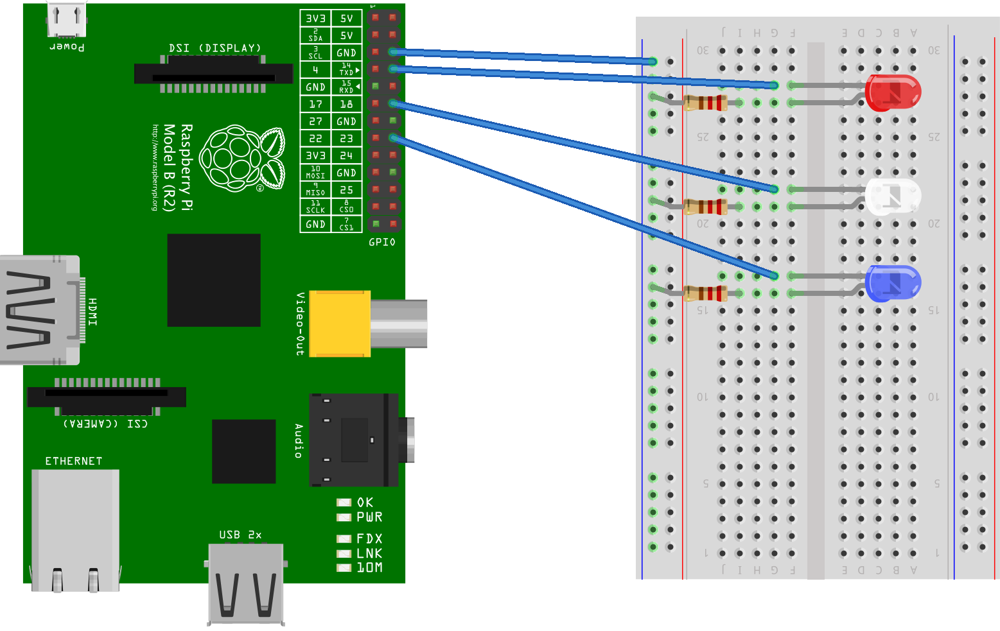

Controllable Lighting
=====================

An example project demonstrating how to create a NodeBot that controls lights via a web interface, powered by a Raspberry Pi. To install Node.js on your Raspberry Pi, check out http://node-arm.herokuapp.com/. To install this app on your Raspberry Pi:

```
npm install -g example-pi-lighting-nodebot
```

Next, wire up some LEDs to your Raspberry Pi like this:



Then run the server with:

```
example-pi-lighting-nodebot
```

At this point, the web server should be up and running! Connect to it from your browser by entering it's IP address in the address bar, and start setting some lights!